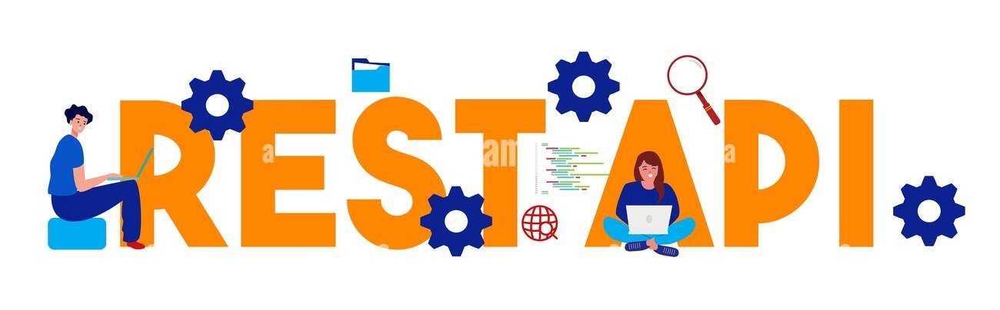
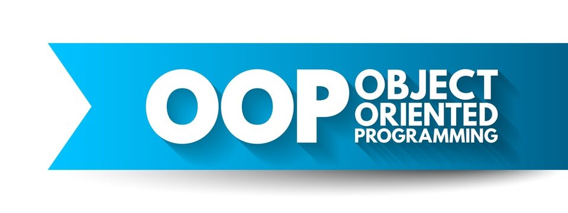

# Hi there, I'm Abu Sufiun 👋

I am an expert in RESTful APIs, Laravel, and React, with a deep understanding of database management systems, including complex queries and database design. I excel in managing intricate and complex projects, as well as deploying projects from scratch. I possess in-depth knowledge of programming and problem-solving, and have experience as a Developer, Instructor, and Researcher. Additionally, I am proficient in AI and Machine Learning.
 
I have a strong knowledge of the multinational textile industry, backed by hands-on experience with its processes. Additionally, I have a deep understanding of international university academics, giving me a well-rounded perspective in both fields.

  

## 🚀 Skills

- **Backend Development**: RESTful API, Laravel, PHP, OOP
- **Frontend Development**: React, JavaScript, Bootstrap, Tailwind CSS
- **Database Management**: MS-SQL, Oracle, My-SQL
- **Programming Languages**: PHP, JavaScript, C
- **Artificial Intelligence & Machine Learning**: AI, ML

 
 
 

## 💼 Professional Experience

- **Mid-Level Developer at Hop Lun**: Developed and maintained complex web applications, ensuring high performance and responsiveness.
- **Lecturer - Department of Computer Science and Engineering at Daffodil International University**: Taught programming and development skills to students, helping them understand complex concepts with ease.

## 📚 Publications

1. **An AIoT-based Hydroponic System for Crop Recommendation and Nutrient Parameter Monitorization**  
   *Smart Agricultural Technology (Q1 Elsevier Journal)*   [Volume 8, August 2024, Article ID 100472](https://www.sciencedirect.com/science/article/pii/S2772375524000777) 
  
   

2. **Exploring the Relationship between Cardiac Disease and Patterns of 12-Lead ECG Through Neural Network: A Comprehensive Review**  
   *Heliyon Journal*  [Vol 24 No 02 (2024): Advances in Systems Science and Applications](https://ijassa.ipu.ru/index.php/ijassa/article/view/1601)
   
   

3. **A Novel Approach of CNN Patterns Extraction for Bangla Handwriting to Bangla Braille Notation**  
   *International Journal of Engineering Advanced Research*, Volume 3, Issue 3, Pages 1-15, December 2021  [ISSN 2710-7167](https://scholar.google.com/citations?view_op=view_citation&hl=en&user=kRtSwYgAAAAJ&citation_for_view=kRtSwYgAAAAJ:d1gkVwhDpl0C)
     
   

4. **Automatic Bengali Number Plate Detection and Authentication using YOLO-V4 and YOLO-V5**  
   *International Conference on Computer and Information Technology (ICCIT)*,   [IEEE Pages 1-6](https://ieeexplore.ieee.org/abstract/document/10441416)
   

## 📫 How to Reach Me

- Email: [abusufiun27@gmail.com](mailto:abusufiun27@gmail.com)
- LinkedIn: [https://www.linkedin.com/in/abu-sufiun/](https://www.linkedin.com/in/abu-sufiun/)
- GitHub: [https://github.com/sufiun27](https://github.com/sufiun27)
- Portfolio: [https://sufiun27.github.io/AbuSufiun/](https://sufiun27.github.io/AbuSufiun/)
- Mobile: +880 1878 000 675

